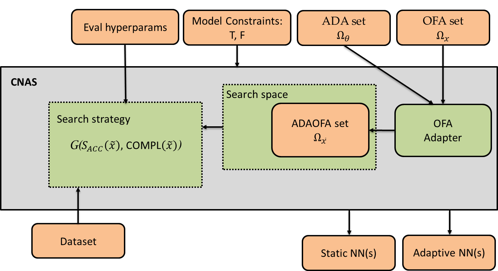

This repository contains the code for a Neural Architecture Search (NAS) framework supporting for:
- technological and functional constraints (introduced in CNAS[1])
- different search spaces: Once-For-All (OFA)[2] (MobileNetV3 with resolutions ranging in 128 - 224) and NASBench201[3] (CNNs with fixed resolution at 32)
- Early Exit classifiers on top of Once-For-All (OFA)[2] backbones (introduced in EDANAS[4]) and constrained in their number of MAC operations (introduced in NACHOS [5])
- Out-Of-Distribution (OOD) robustness optimization accounting for the flatness of the loss landscape (introduced in FLATNAS [6])
## Overview



The inputs of the CNAS framework consist of:
- `Dataset`: a dataset split into a training and a validation set
- `Eval hyperparams`: hyperparameters used for evaluating a candidate network such as the weights of the objectives and the number of epochs of different training stages
- `Model constraints`: functional and technological constraints. The former refers to constraints on the type of processing layers and operations that are carried out in the designed neural network; the latter consists in constraints on the computational and memory demand of the designed neural network.
- `OFA set`: a set of candidate networks sampled from the OFA supernet
- `ADA set`: a set of hyperparameters used for enhancing an OFA backbone with adaptive capability (e.g., early exit). 
  
The modules of CNAS framework consist of:
- `OFA Adapter`: module that takes in input a backbone from the OFA set and a configuration from the ADA set and outputs an enhanced adaptive network.
- `Search Space`: the search space of the NAS. In particular, the ADAOFA search space consists of all the possible configurations of enhanced adaptive networks.
- `Search Strategy`: the search strategy of the NAS. It performs a bi-objective optimization through a genetic algorithm (NSGA-II). The first objective is the predicted accuracy (top1 accuracy or a more refined metric such as the top1_robust used for OOD evaluation) and the second objective is a measure related to the complexity of the network (e.g. the memory demand or the computational demand).
  
The outputs of the CNAS framework consist of:
- `Static NN(s)`: network(s) without adaptive capability.
- `Adaptive NN(s)`: network(s) with adaptive capability.

## Requirements

1. Install requirements with `pip install -r requirements.txt`
2. Install the available search spaces of the NAS with `git clone https://github.com/AI-Tech-Research-Lab/NasSearchSpace.git`
3. Install robustness folder with `git clone https://github.com/AI-Tech-Research-Lab/Robustness.git`
4. Install Early Exit folder with `git clone https://github.com/AI-Tech-Research-Lab/EarlyExits.git` (if needed)

## Contents

- `scripts` contains the scripts needed to perform a search using NAS.
- `results` contains the architecture found by search procedure (if any).
- `NasSearchSpace` contains the available search spaces.
- `NasSearchSpace/ofa/supernets` contains the pretrained weights of the OFA supernets.
- `acc_predictor` contains the accuracy predictors used to evaluate candidate networks in the NAS search.
- `EarlyExits` contains the trainer and the utilities for early exit (optional repo)
- `Robustness` contains the trainer and the utilities for robustness optimization (optional repo)

## Dataset
Download the dataset from the link embedded in the name. Datasets with * can be automatically downloaded.
| Dataset | Type | Train Size | Test Size | #Classes |
|:-:|:-:|:-:|:-:|:-:|
| [ImageNet](http://www.image-net.org/) | IID | 1,281,167 | 50,000 | 1,000 |
| [CINIC-10](https://github.com/BayesWatch/cinic-10) |  | 180,000 | 9,000 | 10 |
| [CIFAR-10](https://www.cs.toronto.edu/~kriz/cifar.html)* | | 50,000 | 10,000 | 10 |
| [CIFAR-100](https://www.cs.toronto.edu/~kriz/cifar.html)* |  | 50,000 | 10,000 | 100 |
| [SVHN](http://ufldl.stanford.edu/housenumbers) | | 73,257 | 26,032 | 10 |
| [CIFAR-10-C](https://github.com/hendrycks/robustness) | OOD| 50,000 | 10,000 | 10 |
| [CIFAR-100-C](https://github.com/hendrycks/robustness) | | 50,000 | 10,000 | 100 |

- The OOD datasets are perturbed versions of the IID counterparts. 15 types of distortions are available (e.g., Gaussian Noise and Impulse Noise) with different levels of intensity (from 1 to 5). The code for the creation of these datasets is available in the `Robustness/utility/ood_dataset.py`. Since these datasets are available only with 32x32 resolution, we provide the code for evaluating the distortions at any resolution in `Robustness/evaluate_cifar10c.py`.

## How to launch the search
```python
Syntax: python msunas.py \
    --resume /path/to/iter/stats \ # iter stats file path
    --n_gpus 8 \ # number of available gpus
    --gpu 1 \ # required number of gpus per evaluation job
    --n_workers [2] \ # number of threads for dataloader
    --n_epochs 5 \ # number of epochs of training of a candidate network. 5 is the suggested value.
    --dataset [cifar10/cifar100/imagenet] \ # dataset 
    --n_classes [10/100/1000] \ # number of classes
    --data /path/to/data/ \ # dataset folder path
    --first_obj [top1/top1_robust] \ #first objective of the NAS optimization
    --sec_obj [params/macs/activations/tiny_ml/avg_macs/top1_robust] \ # second objective of the NAS optimization (optional)
    --first_predictor [as/carts/rbf/mlp/gp] \ # type of the predictor for the first objective. 'as' stands for Adaptive Switching
    --sec_predictor [as/carts/rbf/mlp/gp] \ # type of the predictor for the second objective. 'as' stands for Adaptive Switching
    --supernet_path /path/to/supernet/weights \ # supernet model path
    --search_space \ # ['mobilenetv3', 'eemobilenetv3', 'nasbench201']
    --trainer_type \ # ['single-exit', 'multi-exits']
    --save /path/to/results/folder \ # results folder path
    --iterations [30] \ # number of NAS iterations
    --lr [192] \ # minimum resolution of the search
    --ur [256] # maximum resolution of the search
    -- # Other parameters specific to the task (e.g., the intensity of the perturbation of the weights to study the flatness of the loss landscape)
"""
```
- To launch the search, you can use the above command with the proper syntax or simply run a file in the `scripts` folder.
- It supports searching for *params*, *macs*, *activations*, *tiny_ml*, *avg_macs*, *top1_robust* as the second objective.
- *params*, *macs*, *activations* stand for the number of parameters, the number of macs, the sum of the activation sizes respectively.
- *tiny_ml* is a figure of merit, introduced in CBNAS, accounting jointly for *params*, *macs*, *activations* and the related constraints.
- *avg_macs* is a figure of merit, introduced in EDANAS, for Early Exit Neural Networks accounting for the sum of the number of MACs of each exit of an EENN weighted by the exit ratios of the data. It is different from *macs* which accounts for the number of MACs of the backbone network (i.e., considering the network with a single exit, the final classifier).
- *top1_robust* is a figure of merit, introduced in FLATNAS, accounting jointly for top1 accuracy and the flatness of the loss landscape. It is a metric for OOD generalization.
- To launch the search you can simply run a file in the `scripts` folder.
- Output file structure:
  - Every architecture sampled during search has `net.subnet` and `net.stats` stored in the corresponding iteration dir. 
  - A stats file is generated by the end of each iteration, `iter_x.stats`; it stores every architectures evaluated so far in `["archive"]`, and iteration-wise statistics, e.g. hypervolume in `["hv"]`, accuracy predictor related in `["surrogate"]`.
  - In case any architectures failed to evaluate during search, you may re-visit them in `failed` sub-dir under experiment dir. 
- You can resume the search from a specific previously performed iteration using the `resume` option and specifying the path to the `iter_x.stats` file.
- `--trainer_type` is used to select whether to search single-exit MobileNets (`single-exit`) or multi-exits (i.e., Early Exit Neural Networks) Mobilenets (`multi-exits`) with --search_space `eemobilenetv3`.
## How to choose architectures
Once the search is completed, you can choose suitable architectures by:
- You have preferences, e.g. architectures with xx.x% top-1 acc. and xxxM FLOPs, etc.
```python
""" Find architectures with objectives close to your preferences
Syntax: python post_search.py \
    --save search-cifar10/final \ # path to the dir to store the selected architectures
    --expr search-cifar10/iter_30.stats \ # path to last iteration stats file in experiment dir
    -n 3 \ # number of desired architectures you want, the most accurate architecture will always be selected 
    --prefer params \ # your preferences, i.e. you want an architecture with the lowest sec_obj value (e.g., 'params') or alternatively with the best trade-off ('trade-off')
    --n_exits \ # optional, used to filter the results by the number of exits of the network
    --save_stats_csv \ # flag to be set whether to save post search results
    --first_obj top1 \ # specifies first objective
    --sec_obj params # specifies second objective (optional)
"""
```
- If you do not have preferences, pass `trade-off` to argument `--prefer`, architectures will then be selected based on trade-offs. 
- All selected architectures should have three files created:
  - `net.subnet`: use to sample the network architecture from the supernet
  - `net.stats`: evaluated performance and info related to the network (e.g., accuracy and number or parameters)
  - `ckpt.pth`: the weights of the network after training during the NAS search (optional)
  
## How to validate architectures
To realize the full potential of the searched architectures, we further train the searched network until convergence by fine-tuning from the inherited weights (`ckpt.pth`), if any. Use the `train.py` corresponding to the specific task. For instance, use the script inside the `early_exit` folder to perform the training of the Early Exit Neural Networks.


## References

[1] CNAS: Constrained Neural Architecture Search, SMC 2022 (https://ieeexplore.ieee.org/document/9945080)

[2] ONCE-FOR-ALL: TRAIN ONE NETWORK AND SPECIALIZE IT FOR EFFICIENT DEPLOYMENT, ICLR 2019 (https://openreview.net/pdf?id=HylxE1HKwS)

[3]: NAS-Bench-201: Extending the Scope of Reproducible Neural Architecture Search, ICLR 2020 (https://openreview.net/forum?id=HJxyZkBKDr)

[4] EDANAS: Adaptive Neural Architecture Search for Early Exit Neural Networks, IJCNN 2023 (https://ieeexplore.ieee.org/document/10191876)

[5] NACHOS: Neural Architecture Search for Hardware Constrained Early Exit Neural Networks (https://arxiv.org/abs/2401.13330)

[6] FlatNAS: optimizing Flatness in Neural Architecture Search for Out-of-Distribution Robustness [ACCEPTED WCCI 2024] (https://arxiv.org/abs/2402.19102)
